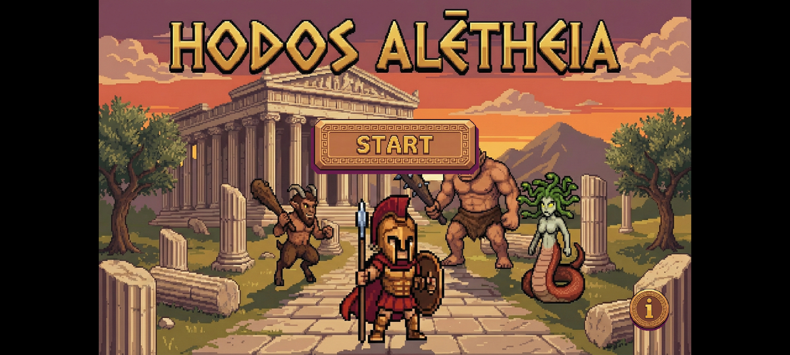
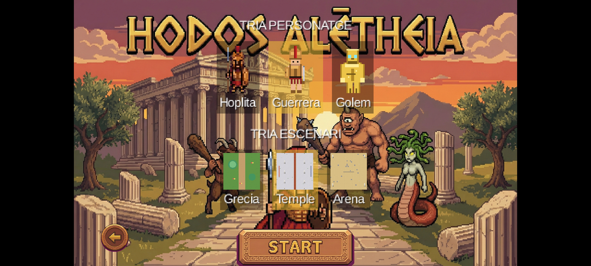
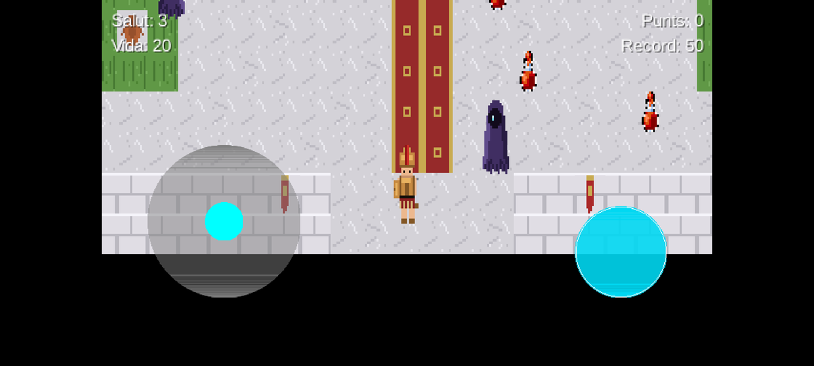
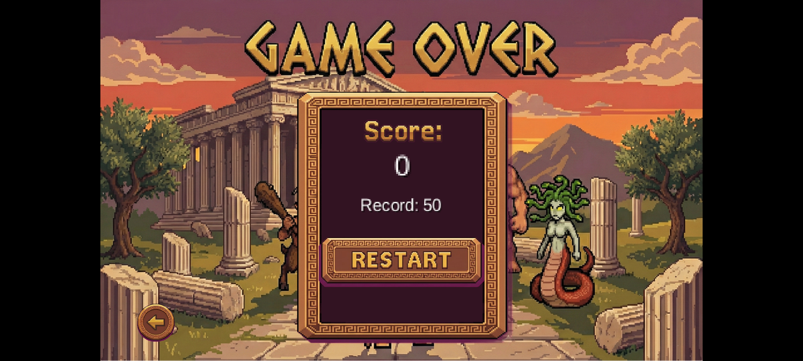

# Hodos Aletheias · Ὁδὸς Ἀληθείας

> *"The Path of Truth"* — a top-down, pixel-art **arcade survival shooter** built with **libGDX + Kotlin** for Android.

Pick a hero, pick a scenario, and survive as long as you can: patrolling satyrs and relentless wraiths close in while your life steadily drains. Chain kills for combo multipliers, grab coins and life, use the portals to escape — and beat your own high score.

> Academic project for the **DAM** (*Desarrollo de Aplicaciones Multiplataforma*) cycle — Android package `dam_mo8_eac4_ex2.conejo_l`.

<p align="center">
  
</p>

---

## 📸 Screenshots

| Character & scenario select | In-game |
|:---:|:---:|
|  |  |
| **Pick 1 of 3 heroes + 1 of 3 maps** | **Survive satyrs and chasing wraiths** |

<p align="center">
  <br>
  <em>Game Over — restart the same run, or take the arrow back to the selector to change hero/map.</em>
</p>

---

## ✨ Features

- 🏛️ **3 selectable scenarios** — *Grècia* (original Greek overworld), *Temple* (Roman temple) and *Arena* (Roman arena), each with its own tileset, decoration and a hand-built **labyrinth**.
- 🎭 **3 playable heroes** — the *Hoplita* (Greek hoplite), the *Guerrera* (Roman warrior woman) and the *Golem* (golden golem), each with full 8-direction idle/walk animations.
- 👹 **2 enemy types** — **satyrs** that patrol (worth +100) and **wraiths** that *chase* the player with per-axis wall-sliding (worth +200).
- 🔥 **Combo system** — chained kills raise a multiplier up to **×5**; the streak expires if you stop killing.
- 📈 **Progressive difficulty** — more satyrs spawn and move faster the longer you last.
- 🪙 **Collectibles** — coins (+50) and life pickups (+5 life, +25 points) that respawn so the map never empties.
- ⏳ **Life decay** — your life bar ticks down over time, forcing you to keep moving and scoring.
- 🌀 **Teleport portals** — paired warp pads to dodge enemies and cross the map.
- 🏛️ **Depth columns** — walk *behind* the upper part of columns via a dedicated "overhead" render layer.
- 🏆 **Persistent high score** — your best run is saved between sessions.
- 🎨 **Procedurally generated** pixel-art sprites, tilesets, maps and sound effects.

---

## 🎮 Controls

| Action | Touch (Android) | Keyboard (debug) |
|---|---|---|
| Move | On-screen **joystick** (bottom-left) | `W` `A` `S` `D` |
| Shoot | Cyan **fire button** (bottom-right) | `Space` |
| Navigate menus | Tap buttons / cells | — |

The in-game UI text is in **Catalan** (the project's language); the source code and comments are in English.

---

## 🧮 Scoring

| Pickup / Kill | Points |
|---|---:|
| Coin | +50 |
| Life pickup | +25 (and +5 life) |
| Satyr | +100 |
| Wraith | +200 |
| Combo | up to **×5** the kill value |

You start with **3 health** and a **life bar of 20** that decays one point every 10 seconds. Run ends when either reaches zero.

---

## 📥 Download & Play

A ready-to-install debug build is included in the repo:

➡️ **[`dist/HodosAletheias-debug.apk`](dist/HodosAletheias-debug.apk)**

1. Download the APK to an Android device (**Android 5.0 / API 21 or newer**).
2. Allow installation from unknown sources if prompted.
3. Install and launch — the game runs in landscape.

---

## 🛠️ Build from source

**Requirements:** JDK 21 (e.g. the Android Studio JBR), the Android SDK with **compileSdk 35**, and the bundled Gradle wrapper.

```bash
# Build the Android debug APK
./gradlew :android:assembleDebug
# Output: android/build/outputs/apk/debug/android-debug.apk
```

Or open the project in **Android Studio** and run the `android` configuration on an emulator or device.

---

## 🧩 Tech stack

- **Language:** Kotlin 2.1.0
- **Engine:** libGDX 1.13.1 (`Game`/`Screen`, Scene2D, `TiledMap` / Tiled `.tmx`, `OrthographicCamera`, `FitViewport`)
- **Build:** Gradle 8.14.3 · Android Gradle Plugin 8.7.3 · compileSdk 35 / minSdk 21
- **Assets:** procedurally generated with Python + Pillow

---

## 📂 Project structure

```
Atheleia/
├─ core/                     # Shared game logic (Kotlin)
│  └─ src/main/kotlin/dam_mo8_eac4_ex2/conejo_l/
│     ├─ GameScreen.kt           # Main loop: state, update, render, scoring
│     ├─ HodosAletheias.kt       # libGDX Game entry point
│     ├─ core/
│     │  ├─ GameHUDController.kt  # Scene2D HUD: menus, selector, gameplay, game over
│     │  ├─ GameAssetManager.kt   # Textures, animations and sound loading
│     │  └─ GameMapParser.kt      # Parses collisions / collectibles / enemies / teleports
│     └─ entities/
│        ├─ Player.kt  Satyr.kt  Wraith.kt
│        └─ Bullet.kt  BulletPool.kt  Collectible.kt
├─ android/                  # Android launcher + assets (maps, sprites, sfx, ui)
└─ dist/                     # Pre-built APK
```

---

## 📜 Notes

This is an educational project. Feel free to read, build and learn from it.
